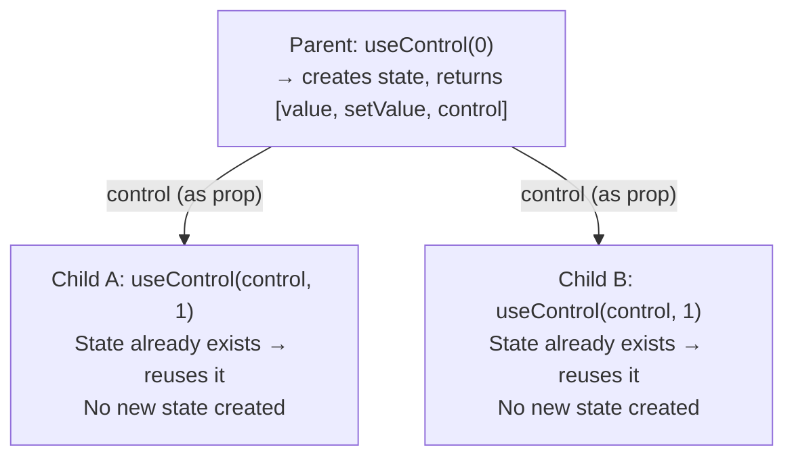

[](https://github.com/wmzy/react-use-control/actions/workflows/ci.yml)
[](https://packagephobia.now.sh/result?p=react-use-control)

# react-use-control

> Make React component state controllable — a tiny (~80 LOC) utility for building components that seamlessly support both **controlled** and **uncontrolled** modes.

## Motivation

In React, component authors often need to support two usage patterns:

- **Uncontrolled**: the component manages its own state internally (`defaultValue`).
- **Controlled**: a parent component owns the state and passes it down (`value` + `onChange`).

Supporting both typically requires boilerplate: checking whether a prop is `undefined`, syncing internal state with external props via `useEffect`, and carefully handling edge cases. Libraries like `@radix-ui/react-use-controllable-state` solve this with a `prop` / `defaultProp` / `onChange` pattern.

**react-use-control** takes a different approach. Instead of passing values and callbacks separately, it introduces a **control object** — an opaque token that carries state authority through the component tree. Whoever creates the state first owns it; everyone else defers. This enables:

- Zero-boilerplate controlled/uncontrolled support
- State sharing across sibling components (not just parent → child)
- Middleware-style state transforms via `useThru`
- Re-render optimization via `controlEqual` (for use with `React.memo`)

## Install

```bash
npm install react-use-control
```

## Quick Start

### Basic: Uncontrolled Component

When no `control` is passed, the component manages its own state:

```jsx
import {useControl} from 'react-use-control';

function Counter() {
  const [count, setCount] = useControl(0);
  return <button onClick={() => setCount((c) => c + 1)}>{count}</button>;
}

// Usage: <Counter />  — works independently
```

### Controlled by Parent

Pass a `control` object to let a parent own the state:

```jsx
function Parent() {
  const [count, setCount, countCtrl] = useControl(0);

  return (
    <div>
      <Counter count={countCtrl} />
      <button onClick={() => setCount(0)}>Reset</button>
      <p>Parent sees: {count}</p>
    </div>
  );
}

function Counter({count}) {
  const [num, setNum] = useControl(count, 0);
  return <button onClick={() => setNum((n) => n + 1)}>{num}</button>;
}
```

### Sharing State Across Siblings

The same `control` can be passed to multiple children — they all share the same state:

```jsx
function App() {
  const [, setCount, countCtl] = useControl(0);

  return (
    <div>
      <Counter count={countCtl} />
      <Counter count={countCtl} />
      <button onClick={() => setCount(0)}>Reset Both</button>
    </div>
  );
}
```

## How It Works



When a child calls `useControl(control, initial)`, it checks whether state has already been created upstream. If so, the child reuses it directly; otherwise it creates local state. This means:

- **No context providers needed** — state flows through props
- **No `useEffect` synchronization** — parent and child share the same state, not two copies kept in sync
- **`initial` is ignored** when controlled — just like React's `useState`

> For a deeper dive into the problem and the design rationale, see [Who Owns the State? Rethinking Controlled/Uncontrolled Components in React](docs/blog/state-ownership-in-react.md).

## API

### `useControl(controlOrInitial?, initial?)`

```ts
function useControl<S>(
  control: Control<S> | null | undefined,
  initial: S | (() => S)
): [S, Dispatch<SetStateAction<S>>, Control<S>];

function useControl<S>(
  initial: S | (() => S)
): [S, Dispatch<SetStateAction<S>>, Control<S>];
```

- `controlOrInitial` — a control object from a parent, an initial state value, or `null`/`undefined` for uncontrolled mode. When a non-control value is passed, it is used as the initial state directly.
- `initial` — initial state value as the second argument (ignored when controlled). When the first argument is not a control, the first argument takes precedence.
- Returns `[value, setValue, control]` — same shape as `useState`, plus the control object for passing to children.

### `useThru(control, interceptor)`

```ts
function useThru<S>(
  control: Control<S> | null | undefined,
  interceptor: (state: [S, SetState<S>]) => [S, SetState<S>]
): Control<S>;
```

Insert a middleware that transforms state or setter before passing to children:

```jsx
import {useThru, mapSetter} from 'react-use-control';

function DoubleOnSet({count}) {
  const control = useThru(
    count,
    mapSetter((v) => v * 2)
  );
  return <Counter count={control} />;
}
```

### `mapState(fn)`

Transform the state value read by children:

```js
mapState((count) => count * 100); // children see count × 100
```

### `mapSetter(fn)`

Transform the value before it reaches `setState`:

```js
mapSetter((v) => Math.max(0, v)); // clamp to non-negative
```

### `watch(onChange)`

Side-effect on state changes (logging, analytics, etc.):

```js
watch((v) => console.log('new value:', v));
```

### `controlEqual(prevProps, nextProps)`

```ts
function controlEqual<P extends Record<string, unknown>>(
  prev: P,
  next: P
): boolean;
```

A comparison function for `React.memo`. It shallow-compares props, but for control objects it compares the **state value** inside rather than the object reference:

```jsx
import {memo} from 'react';
import {useControl, controlEqual} from 'react-use-control';

const Counter = memo(function Counter({count}) {
  const [num, setNum] = useControl(count, 0);
  return <button onClick={() => setNum((n) => n + 1)}>{num}</button>;
}, controlEqual);
```

> **Why is this needed?** — Due to an internal caching mechanism, the control object reference may not update on every state change. `React.memo` compares props by reference by default, so it may skip re-renders. `controlEqual` fixes this by comparing the state values carried inside control objects.

### `isControl(value)`

Type guard to check if a value is a control object:

```js
isControl(someValue); // true | false
```

## Comparison with Other Approaches

| Feature                  | react-use-control                    | @radix-ui/react-use-controllable-state | Manual (useState + useEffect)     |
| ------------------------ | ------------------------------------ | -------------------------------------- | --------------------------------- |
| Controlled/Uncontrolled  | ✅ Automatic via control object      | ✅ Via `prop`/`defaultProp`/`onChange` | ⚠️ Manual boilerplate             |
| State sharing (siblings) | ✅ Same control to multiple children | ❌ Not supported                       | ❌ Lift state + pass individually |
| Middleware transforms    | ✅ `useThru` + composable transforms | ❌ Not supported                       | ❌ Manual wrappers                |
| Re-render optimization   | ✅ Built-in dirty tracking           | ✅ Standard React patterns             | ⚠️ Depends on implementation      |
| Bundle size              | ~80 LOC, zero deps                   | ~150 LOC, 2 internal deps              | N/A                               |
| Learning curve           | Medium (control object concept)      | Low (familiar prop pattern)            | Low                               |
| Ecosystem adoption       | Niche                                | Widely used (Radix, shadcn/ui)         | Universal                         |

**When to choose react-use-control:**

- Any React component that exposes internal state to its parent — forms, toggles, dialogs, tabs, filters, etc.
- Sibling components that need to share state without lifting it manually
- State flow that benefits from middleware-style transforms (clamping, logging, mapping)
- You prefer a single prop (`control`) over the `value`/`defaultValue`/`onChange` triple

**When to choose radix or manual approach:**

- You need maximum ecosystem familiarity
- You're already using Radix UI primitives and want to stay consistent

## Workflow

```bash
# develop with watch mode
npm start

# run tests
npm test

# build
npm run build

# storybook
npm run storybook

# commit changes
npm run commit
```

## License

[MIT](LICENSE)
